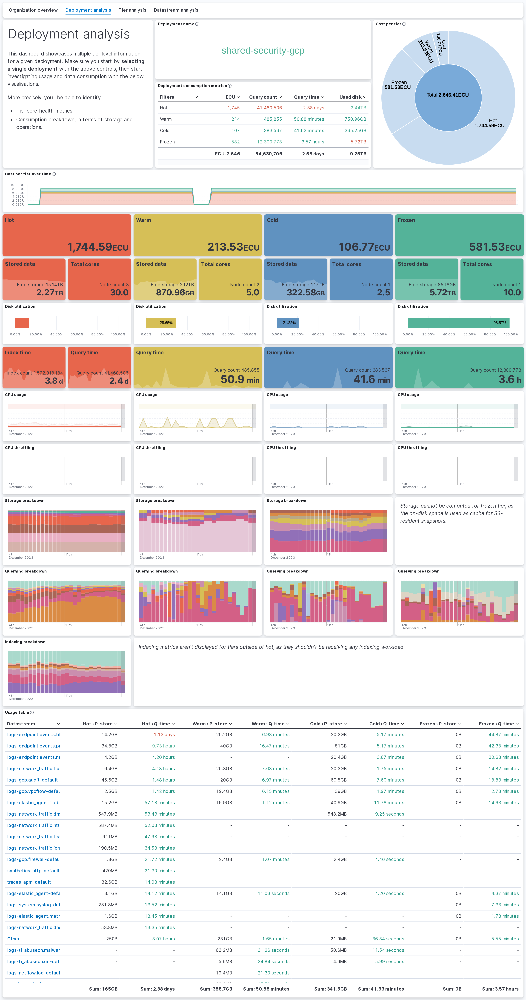
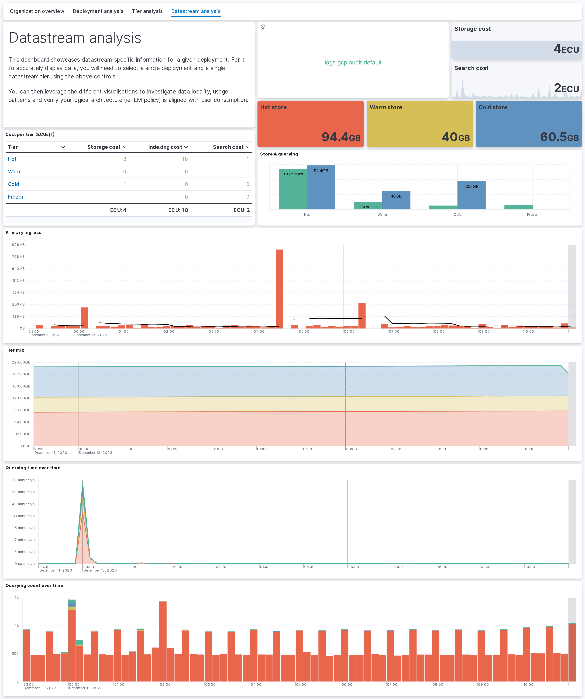
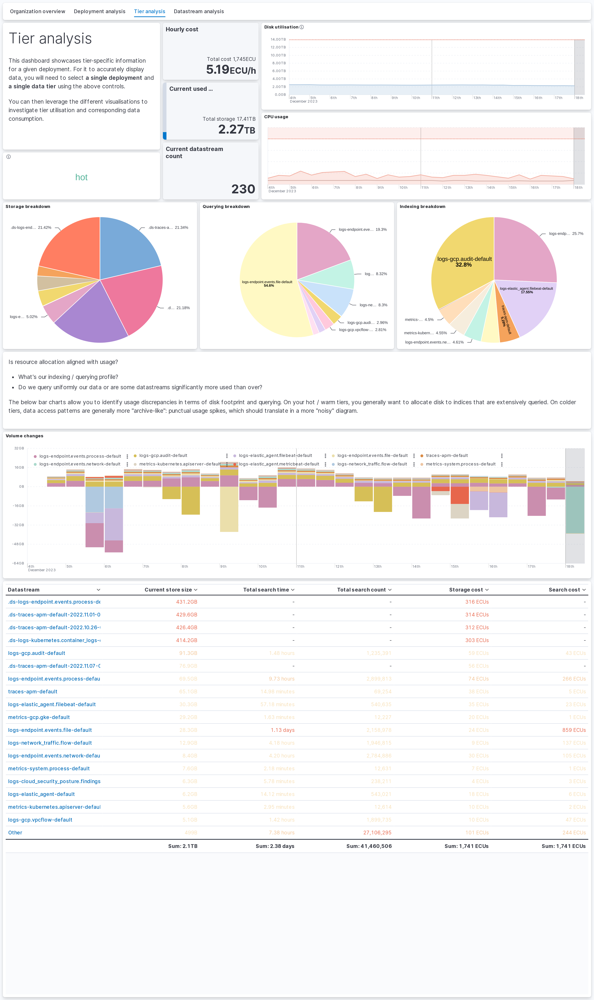
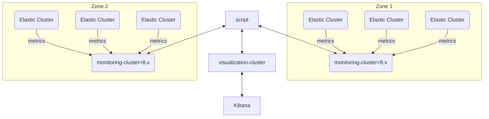

# Consumption Framework tools

This repository contains various tools aiming to help Elasticsearch users better understand the consumption patterns of their deployments. They don't aim to be purely used in cost reduction / optimization efforts, but rather to help users understand resource allocation, and how to better plan for growth.

Namely, thanks to the data these tool can gather, and the Kibana dashboards through which they can be visualized, users can:

- Understand ingest patterns and cost allocation for their entire organization.
- Explore billing data in ways that are not offered out-of-the-box by Elastic Cloud interface.
- Understand how much data is being indexed, and how storage is being used.

## Screenshots

<details>

<summary>Click to expand</summary>








</details>

## Minimal requirements

- Elastic version > 8.0
- Python minimal version > 3.11
  > pandas>=1.5.0 - Check compatibility [here](https://pandas.pydata.org/pandas-docs/version/1.5/getting_started/install.html)

## How to use?

The `main.py` script exposes multiple commands:

```bash
Usage: main.py [OPTIONS] COMMAND [ARGS]...

Options:
  --help  Show this message and exit.

Commands:
  consume-monitoring  Consume monitoring data from an existing cluster
  get-billing-data    Recover org-level billing data from ESS
  init                Initialize the target cluster
```

- `init` will create the index templates, ILM policy and ingest pipelines required for the other commands to work.
- `get-billing-data` will recover the billing data from ESS, and index it into the target cluster. This will populate the organization overview dashboard.
- `consume-monitoring` will consume monitoring data from an existing cluster, and index it into the target cluster. This will populate all further dashboards and give you the most granularity about your data and its usage.

## How does it work?

The ingestion is made as following :

1. ESS clusters are sending their metrics to a centralized [monitoring instance](https://www.elastic.co/guide/en/cloud/current/ec-enable-logging-and-monitoring.html)
2. The script consume native _.monitoring*_ index and send to a visualization cluster.



More information about the execution model can be found in [this deck](https://docs.google.com/presentation/d/1aJutCxUlVtnDaTwz-QwcaWMex133edXl-CmV-KeOXPU/edit#slide=id.g2ac43bd4279_0_0) (Elasticians-only link).

### Billing data

The script hits the [billing APIs of ESS](https://www.elastic.co/guide/en/cloud/current/Billing_Costs_Analysis.html) and saves the results to your target cluster, in a format that can then be easily consumed through Kibana dashboards. Since the data is saved on Elastic side, you can go back as far as you'd like in time, and the script will only fetch the data that is not already present in the target cluster.

### Monitoring data

The based principle of this command is to piggyback on existing monitoring data, collected by built-in monitoring collectors. The main challenges are:

1. The data is collected on the index level, and therefore needs to be tied in to business-level information such as the data tier or the datastream.
2. The counters on which the data is based are reset upon shard movement, it is therefore necessary to compare data points with one another in order to understand the evolution of the metrics, rather than the instantaneous value of the counter.

To tackle these challenges, the script will not strictly look at a point in time, but rather the evolution of monitoring data across 10-minutes chunks, and enrich the index-level information with context coming from the nodes where the indices are hosted. Since the shard of an index can move at any point during these 10 minutes chunk, it is important to note that the results should be considered as approximations.

Once index-level data is properly contextualized, it is then aggregated at the datastream + tier level and billing information is ventilated to the datastreams according to their fractional usage of the tier. 3 dimensions are used to ventilate the billing information:

- Storage size. A datastream that uses 10% of the storage of a tier will be allocated 10% of total cost of the tier.
- Query time. A datastream that uses 10% of the query time of a tier will be allocated 10% of total cost of the tier.
- Indexing time. A datastream that uses 10% of the indexing time of a tier will be allocated 10% of total cost of the tier.

Even though each individual dimension alone doesn't accurately represent the full business usage of a datastream, the combination of the 3 dimensions and most importantly the discrepancies among them can help users understand the usage of their data.

## FAQ

Please see [this document](https://docs.google.com/document/d/1QlAValDdp8B0oFABdeSemeBH3ukPj7agulg68AhXfUM/edit#heading=h.3v16o5fpcokw) (Elasticians-only link) for FAQ.

## Configuration file

The configuration file is a YAML file that contains the following information

```yaml
---
# The name of your organization, this will be populated on every single resulting document
organization_name: "Change me"

# The organization ID from Elastic Cloud, for ESS deployments.
# You can comment this out for on-premises deployments
organization_id: "12345"

# The billing API key for your organization
# You can comment this out for on-premises deployments
billing_api_key: "essu_XXXX"

# Where we'll read the monitoring data from
monitoring_source:
  hosts: 'https://where-i-want-to-get-the-data:443'
  api_key: 'ZZZZZZZZZZZ'
  retry_on_timeout: true
  request_timeout: 60

# Where the consumption data (result of the script's run) will be sent
# This can be the same cluster as the source.
consumption_destination:
  hosts: 'https://where-i-want-the-data-to-be-indexed:443'
  api_key: 'YYYYYYYYYYY'

# For on-premises deployment, you'll need to specify the costs of your tier per 1 GB RAM per hour
# on_prem_costs:
#   hot: 1.0
#   warm: 0.5
#   cold: 0.25
#   frozen: 0.1

# Uncomment and modify this if you want to read indices other than the default monitoring ones
# (for example using cross-cluster search)
# monitoring_index_pattern: '.monitoring-es-8*'

# Uncomment and modify this for Federal customers using a non-standard ESS endpoint
# api_host: 'api.elastic-cloud.com'
```

* `organization_id` is the ID of your Elastic Cloud organization. This needs to match what is reported in ESS.
* `organization_name` is the name of your Elastic Cloud organization. You can name it as you wish, it can be useful to aggregate multiple organization\_ids under the same name.
* `billing_api_key` is the API key that will be used to fetch billing data from ESS. This key will require billing admin permissions, and needs to be generated for the target `organization_id`.
* `monitoring_source` and `consumption_destination` (formerly `source` and `monitoring`) describe parameters natively passed to an [`Elasticsearch` client](https://elasticsearch-py.readthedocs.io/en/latest/api/elasticsearch.html). The `monitoring_source` section is used to fetch monitoring data from the source cluster, and the `consumption_destination` section is used to index the data into the target cluster. These can be identical, provided that the credentials have the proper permissions.
* `on_prem_costs` is a mapping of the cost per GB of RAM per hour for each tier. This is used to compute the cost of on-prem clusters.
* `monitoring_index_pattern` is the pattern used to fetch monitoring data. This is useful if you are using a custom pattern for your monitoring indices, or want to use CCS to query monitoring data across multiple clusters. The default value is `.monitoring-es-8*`.
* `api_host` is the host of the ESS API. This is used to fetch billing data. The default value is `api.elastic-cloud.com`.

`organization_id`/`billing_api_key` and `on_prem_costs` are mutually exclusive.

It is also possible to pass the configuration inline, using the `--config-inline` parameter. In that case, you should pass the configuration as a JSON string. You can also override individual parameters using the `--config KEY=VALUE` parameter (multiple times if needed).

## HOW-TO

Check [this document](https://docs.google.com/document/d/1kyaO9CELxmrttmmIFQWWxLlgahOEaZU7PXG5jOz9b8g/edit) (Elasticians-only link, but ok to share a pdf externally) for a description of the deployment of the tool.

## Permissions

In the `monitoring_source` cluster, the script will be reading the `.monitoring-es-8*` indices. The user (or API key) used to connect to the cluster will therefore need to have the corresponding `read` permission. The below API call can be used to provision the required API key on the `monitoring_source` cluster:

<details>

<summary>Dev tools API call to create the source API key</summary>

```
POST /_security/api_key
{
  "name": "consumption_framework_source",
  "role_descriptors": {
    "consumption_framework": {
      "indices": [
        {
          "names": [
            ".monitoring-es-8*"
          ],
          "privileges": [
            "read"
          ]
        }
      ]
    }
  }
}
```

</details>

In the `consumption_destination` cluster, the script will be writing to `consumption-[DATE]` indices. Again, the user needs to have the corresponding `index` and `auto_configure` permissions.
The additional `read` permission on the index is necessary for backlog checks, preventing the script from re-computing already existing data (see the command help for more information).

<details>

<summary>Dev tools API call to create the destination API key</summary>

```
POST /_security/api_key
{
  "name": "consumption_framework_destination",
  "role_descriptors": {
    "consumption_framework": {
      "indices": [
        {
          "names": [
            "consumption*"
          ],
          "privileges": [
            "read",
            "view_index_metadata",
            "index",
            "auto_configure"
          ]
        }
      ]
    }
  }
}
```

</details>

Finally, if you want to use the `init` command, you will need to add the `manage_ingest_pipelines`, `manage_ilm` and `manage_index_templates` cluster privileges.
You could also manually upload the ingest pipeline, ILM policy and index template from the [`consumption/_meta`](consumption/_meta) directory to your `consumption_destination` cluster.

